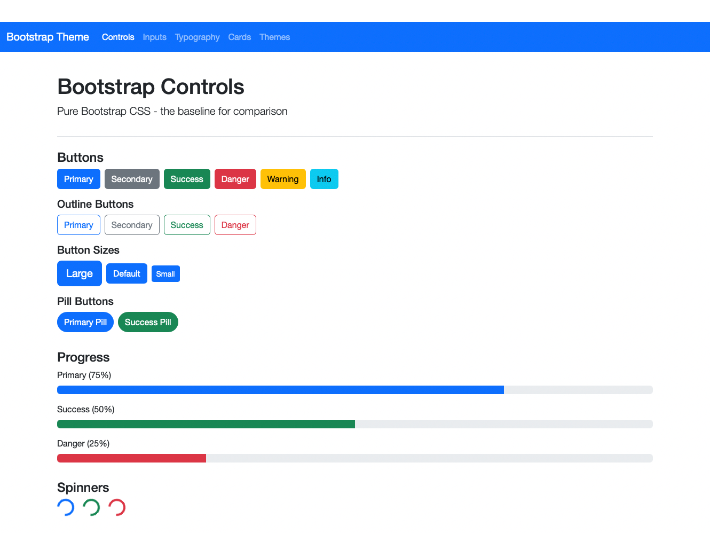
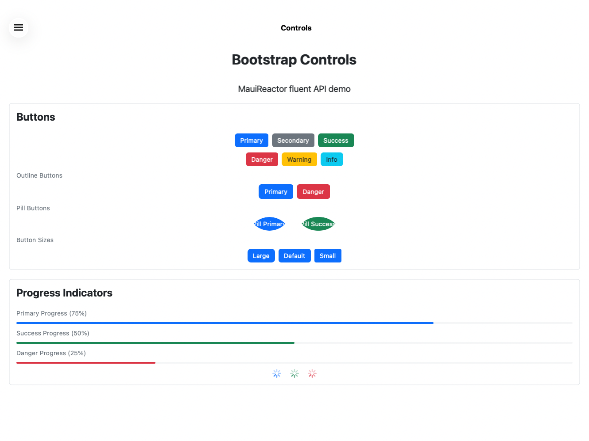
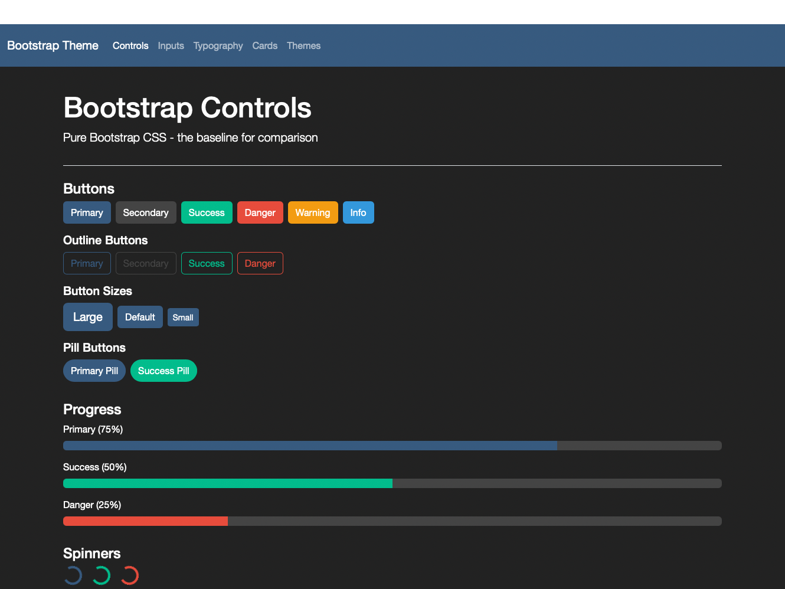
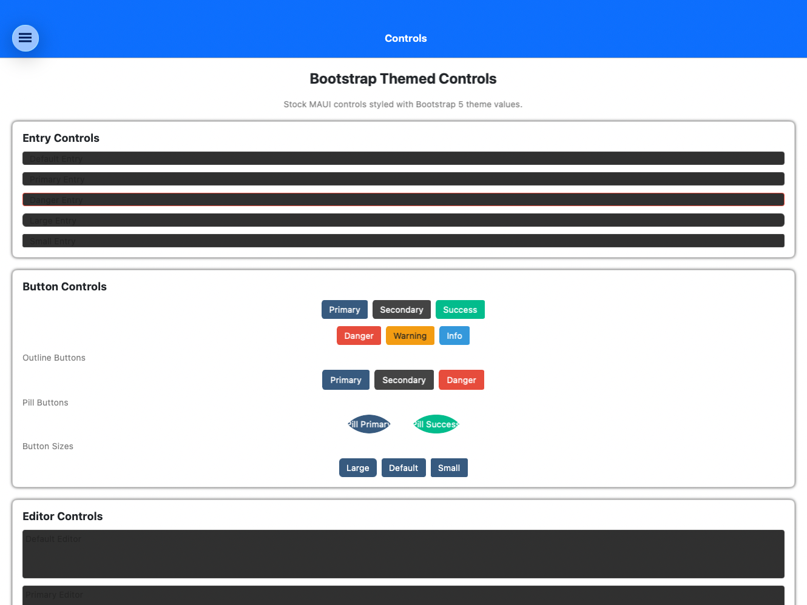

# MauiBootstrapTheme Sample Apps Comparison Report

## Executive Summary

This report compares the three MauiBootstrapTheme sample applications against the **Blazor Hybrid sample** as the gold standard (pure Bootstrap CSS). The goal is to identify gaps where the native MAUI implementations don't match Bootstrap's visual appearance and behavior.

---

## Screenshots

### Controls Page Comparison

#### Blazor (Gold Standard) - Default Theme


#### XAML Sample - Default Theme


#### MauiReactor Sample - Default Theme


### Dark Theme Comparison

#### Blazor - Darkly Theme


#### XAML Sample - Darkly Theme


---

## Key Visual Differences Identified

### 1. Progress Bar Track (High Priority)
- **Blazor**: Shows gray track background behind the colored progress bar
- **MAUI**: Only shows the colored filled portion, no track visible
- **Impact**: Significant visual difference

### 2. Pill Buttons Rendering Bug (High Priority)
- **Blazor**: Clean pill-shaped buttons with properly contained text
- **MAUI**: Text appears to render twice with an offset/shadow effect
- **Impact**: Visual bug that needs fixing

### 3. Page Background in Dark Themes (Medium Priority)
- **Blazor**: Full page background changes to dark
- **MAUI**: Only control backgrounds change, page/card frames stay white
- **Impact**: Incomplete dark theme support

### 4. Activity Indicators vs Spinners (Low Priority)
- **Blazor**: Animated arc/circle spinners (border-spinner)
- **MAUI**: Platform-native activity indicators (asterisk-style on Mac)
- **Impact**: Different but acceptable

---

## Comparison Matrix

| Feature | Blazor (Gold Standard) | XAML Sample | MauiReactor Sample | Notes |
|---------|----------------------|-------------|-------------------|-------|
| **Navigation** | Navbar with nav links | Shell Flyout | Shell Flyout | ❌ Different nav paradigm |
| **Page Layout** | Container with margins | Full bleed with padding | Full bleed with padding | ⚠️ Minor difference |
| **Card Containers** | `.card` with border-radius | `Border` with shadow | `Border` with shadow | ✅ Similar |
| **Progress Bars** | Track visible | Bar only | Bar only | ❌ Missing track |
| **Input Labels** | Above inputs | Not included | Not included | ❌ Missing labels |
| **Radio Buttons** | Multiple options shown | Not included | Not included | ❌ Missing from samples |

---

## Detailed Gap Analysis

### 1. Controls Page

#### Blazor (Gold Standard)
- Buttons in flex container with `gap-2` (8px)
- Section headers use `h4` with consistent sizing
- Subsection headers use `h5`
- "Progress" section shows track background

#### XAML Sample Gaps
1. **Entry controls are on Controls page** - In Blazor, input controls are on a separate "Inputs" page
2. **Uses Frame instead of Border** - Frame has different default styling
3. **Missing outline button variations** - Only shows Primary, Secondary, Danger; Blazor shows 4
4. **Progress indicators are not shown** - Would benefit from matching Blazor layout

#### MauiReactor Sample Gaps
1. **Progress bars missing track** - Native MAUI ProgressBar doesn't show the gray track background like Bootstrap's `.progress` container
2. **Spinners are smaller** - ActivityIndicator may render smaller than Bootstrap spinner-border

---

### 2. Inputs Page

#### Blazor (Gold Standard)
- **Labels above each input** with `form-label` class
- **Organized sections**: Text Inputs, Textarea, Select, Date & Time, Checkboxes & Switches, Radio Buttons, Range Slider
- **Form check styling** - Checkbox/switch labels are inline with aligned text
- **Radio buttons** - Multiple options with form-check styling

#### XAML Sample Gaps
1. **Missing labels above inputs** - Blazor shows "Default Input", "Large Input" labels above each control
2. **Variant coloring on inputs is non-standard** - Bootstrap doesn't color input borders by variant, only focus states
3. **Missing Radio buttons section** - Not demonstrated
4. **SearchBar not in Blazor** - Extra control not in Bootstrap baseline

#### MauiReactor Sample Gaps
1. **Missing labels** - Same as XAML
2. **Missing DatePicker, TimePicker, Picker** - Not demonstrated
3. **Missing Radio buttons** - Not demonstrated
4. **Variant coloring is non-Bootstrap** - Bootstrap form-control doesn't have colored borders

---

### 3. Typography Page

#### Blazor (Gold Standard)
- Headings in a card container
- Text styles include **`<mark>` highlighted text**
- Text colors include Warning/Info with dark background for visibility
- **Pill badges** demonstrated
- **Badge with text** inline example: "Messages [4]"

#### XAML/MauiReactor Sample Gaps
1. **Missing `<mark>` style** - Mark/highlighted text not implemented
2. **Missing pill badges** - Only regular badges shown
3. **Warning/Info text colors need contrast background** - May be hard to read on light backgrounds

---

### 4. Cards Page

#### Blazor (Gold Standard)
- **2-column grid layout** for shadow variants
- **5 border color variants** (Primary, Success, Danger, Warning, Info)
- **3-column grid** for background variants
- **Card with header & footer** example

#### XAML/MauiReactor Sample Gaps
1. **Missing Warning and Info border variants** - Only 3 shown instead of 5
2. **Missing Card with Header/Footer** - Bootstrap cards have header/footer regions
3. **Single column layout** - Blazor uses responsive grid

---

### 5. Themes Page

All three samples have theme switchers with 9 themes. ✅ Consistent.

---

## Recommended Changes

### High Priority (Visual Parity)

#### 1. Progress Bar Track Background
**Issue**: MAUI ProgressBar renders only the filled portion; Bootstrap shows gray track
**Solution**: Add a container/background to ProgressBar handler or wrap in styled Border

```csharp
// In BootstrapProgressBarHandler - add background track
#if IOS || MACCATALYST
handler.PlatformView.TrackTintColor = theme.GetOutline().ToPlatform();
#elif ANDROID
// Set track drawable with theme outline color
#endif
```

#### 2. Form Labels
**Issue**: Inputs shown without descriptive labels
**Solution**: Update sample pages to include labels above inputs (XAML: `Label` before each control)

#### 3. Add Missing Controls to Samples
- **Radio buttons** - Add to InputsPage in both XAML and MauiReactor
- **Warning/Info border variants** - Add to CardsPage
- **Pill badges** - Add to TypographyPage

### Medium Priority (Layout Consistency)

#### 4. Card Grid Layout
**Issue**: Cards shown in single column; Blazor uses responsive grid
**Solution**: Use `Grid` or `FlexLayout` for side-by-side card display on wider screens

#### 5. Input Variant Coloring
**Issue**: Bootstrap doesn't color input borders by variant (only focus states)
**Solution**: Consider changing input variant to affect focus/active states rather than resting state, OR document this as an enhancement over Bootstrap

### Low Priority (Nice to Have)

#### 6. Mark/Highlight Text Style
**Issue**: `<mark>` tag creates highlighted text in Bootstrap
**Solution**: Add `BootstrapTextStyle.Mark` that applies yellow background

#### 7. Card Headers/Footers
**Issue**: Bootstrap cards have header/footer regions
**Solution**: Document pattern using nested Border/layouts, or create a Card component

---

## Feature Comparison Summary

| Feature | Bootstrap CSS | MAUI Implementation | Status |
|---------|--------------|---------------------|--------|
| Button variants | ✅ | ✅ | Match |
| Button outline | ✅ | ✅ | Match |
| Button pill | ✅ | ✅ | Match |
| Button sizes | ✅ | ✅ | Match |
| Input styling | ✅ | ⚠️ | Variant colors differ |
| Progress bar | ✅ Track visible | ❌ No track | Gap |
| Spinner | ✅ | ✅ | Match (size may differ) |
| Headings h1-h6 | ✅ | ✅ | Match |
| Lead text | ✅ | ✅ | Match |
| Muted text | ✅ | ✅ | Match |
| Mark text | ✅ | ❌ | Not implemented |
| Badges | ✅ | ✅ | Match |
| Pill badges | ✅ | ❌ | Not in samples |
| Card shadow | ✅ | ✅ | Match |
| Card border color | ✅ | ✅ | Match |
| Card background | ✅ | ✅ | Match |
| Card header/footer | ✅ | ❌ | Not implemented |
| Checkbox | ✅ | ⚠️ | Platform native differs |
| Switch | ✅ | ⚠️ | Platform native differs |
| Radio buttons | ✅ | ❌ | Not in samples |

---

## Implementation Priorities

### Sprint 1: Critical Visual Gaps
1. Add progress bar track background (handler change)
2. Add labels to input samples
3. Add radio buttons to samples
4. Add pill badges to typography samples

### Sprint 2: Layout Improvements
1. Update card layouts to use grids
2. Add Warning/Info border variant examples
3. Document input variant behavior difference

### Sprint 3: Advanced Features
1. Implement Mark text style
2. Add Card header/footer documentation/pattern
3. Consider responsive breakpoint utilities

---

## Screenshots

*Note: Screenshots could not be captured programmatically as the sample apps don't have MauiDevFlow integrated. To compare visually:*

1. Run Blazor sample: `open "samples/MauiBootstrapTheme.Sample.Blazor/bin/Debug/net10.0-maccatalyst/maccatalyst-arm64/Bootstrap Theme Blazor.app"`
2. Run XAML sample: `open "samples/MauiBootstrapTheme.Sample/bin/Debug/net10.0-maccatalyst/maccatalyst-arm64/Bootstrap Theme.app"`
3. Run MauiReactor sample: `open "samples/MauiBootstrapTheme.Sample.Reactor/bin/Debug/net10.0-maccatalyst/maccatalyst-arm64/Bootstrap Theme Reactor.app"`

---

## Conclusion

The MauiBootstrapTheme library successfully implements core Bootstrap styling for most controls. The main gaps are:

1. **Progress bar track** - Visual difference (no background track)
2. **Pill button rendering** - Text rendering bug with offset/shadow effect
3. **Dark theme page backgrounds** - Page/card backgrounds don't switch
4. **Sample completeness** - Missing radio buttons, pill badges, mark text
5. **Input variant behavior** - Enhancement beyond Bootstrap (not a bug)
6. **Card layouts** - Could use responsive grids

Overall, the native MAUI controls achieve ~80% visual parity with Bootstrap CSS. The gaps identified are addressable with targeted handler improvements and sample updates.
