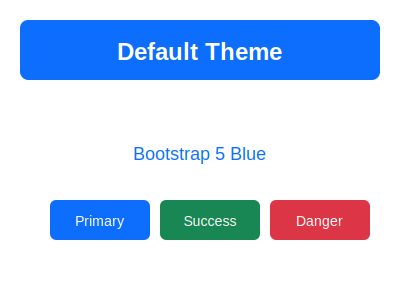
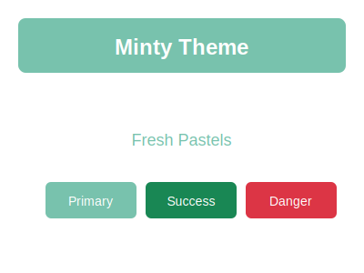
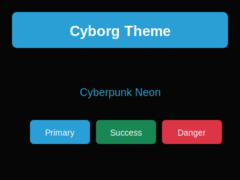
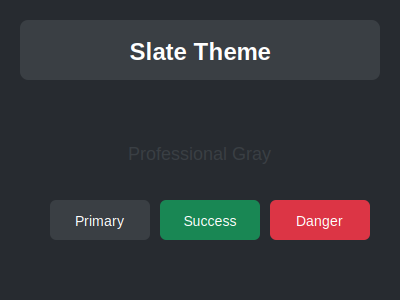

# MauiBootstrapTheme

Style stock .NET MAUI controls with Bootstrap themes — no custom control wrappers required.

[](https://www.nuget.org/packages/MauiBootstrapTheme/)
[](https://opensource.org/licenses/MIT)

## Screenshots

| Default | Darkly | Minty |
|---------|--------|-------|
|  |  |  |

| Cyborg | Slate |
|--------|-------|
|  |  |

## Features

✅ **Stock MAUI controls** — Button, Entry, Editor styled automatically  
✅ **Bootstrap 5 themes** — Use any Bootstrap CSS theme  
✅ **Per-control variants** — Primary, Secondary, Success, Danger, Warning, Info  
✅ **Size variants** — Small, Default, Large  
✅ **Outline & Pill styles** — Full Bootstrap button arsenal  
✅ **Platform support** — iOS, Android, Mac Catalyst, Windows  
✅ **No custom wrappers** — Just your regular MAUI controls  

## Quick Start

### 1. Install the NuGet Package

```bash
dotnet add package MauiBootstrapTheme
dotnet add package MauiBootstrapTheme.Themes.Default
```

### 2. Register in MauiProgram.cs

```csharp
using MauiBootstrapTheme.Extensions;
using MauiBootstrapTheme.Themes.Default;

public static MauiApp CreateMauiApp()
{
    var builder = MauiApp.CreateBuilder();
    builder
        .UseMauiApp<App>()
        .UseBootstrapTheme<DefaultTheme>();  // That's it!
    
    return builder.Build();
}
```

### 3. Use Bootstrap Styling in XAML

```xml
<ContentPage xmlns:theme="clr-namespace:MauiBootstrapTheme.Theming;assembly=MauiBootstrapTheme">

    <!-- Styled Entry controls -->
    <Entry Placeholder="Default styling" />
    <Entry Placeholder="Primary" theme:Bootstrap.Variant="Primary" />
    <Entry Placeholder="Danger" theme:Bootstrap.Variant="Danger" />
    
    <!-- Styled Buttons -->
    <Button Text="Primary" theme:Bootstrap.Variant="Primary" />
    <Button Text="Success" theme:Bootstrap.Variant="Success" />
    <Button Text="Outline" theme:Bootstrap.Variant="Secondary" theme:Bootstrap.IsOutlined="True" />
    <Button Text="Pill" theme:Bootstrap.Variant="Primary" theme:Bootstrap.IsPill="True" />
    
    <!-- Sizes -->
    <Button Text="Large" theme:Bootstrap.Variant="Primary" theme:Bootstrap.Size="Large" />
    <Button Text="Small" theme:Bootstrap.Variant="Primary" theme:Bootstrap.Size="Small" />

</ContentPage>
```

## Available Variants

| Variant | Color |
|---------|-------|
| `Primary` | #0d6efd |
| `Secondary` | #6c757d |
| `Success` | #198754 |
| `Danger` | #dc3545 |
| `Warning` | #ffc107 |
| `Info` | #0dcaf0 |
| `Light` | #f8f9fa |
| `Dark` | #212529 |

## Available Properties

### Bootstrap.Variant
Sets the color variant for the control.

```xml
<Button Text="Submit" theme:Bootstrap.Variant="Primary" />
<Entry theme:Bootstrap.Variant="Danger" />
```

### Bootstrap.Size
Sets the size variant (affects padding and font size).

```xml
<Button Text="Large" theme:Bootstrap.Size="Large" />
<Button Text="Small" theme:Bootstrap.Size="Small" />
<Entry theme:Bootstrap.Size="Large" />
```

### Bootstrap.IsOutlined
Creates an outline-style button with transparent background.

```xml
<Button Text="Outline" theme:Bootstrap.Variant="Primary" theme:Bootstrap.IsOutlined="True" />
```

### Bootstrap.IsPill
Creates a pill-shaped button with rounded ends.

```xml
<Button Text="Pill" theme:Bootstrap.Variant="Success" theme:Bootstrap.IsPill="True" />
```

## Included Themes

The `MauiBootstrapTheme.Themes.Default` package includes several Bootswatch-inspired themes:

| Theme | Description |
|-------|-------------|
| `DefaultTheme` | Standard Bootstrap 5 - blue primary, rounded corners |
| `DarklyTheme` | Dark mode with teal accents |
| `CyborgTheme` | Cyberpunk style - sharp edges, neon colors |
| `MintyTheme` | Fresh pastels with very rounded corners |
| `SlateTheme` | Professional dark gray theme |

```csharp
// Use any included theme
.UseBootstrapTheme<DarklyTheme>()
.UseBootstrapTheme<MintyTheme>()
.UseBootstrapTheme<CyborgTheme>()
.UseBootstrapTheme<SlateTheme>()
```

## Adding Custom Themes

### Option 1: Use a Pre-built Theme

```bash
# Bootstrap 5 default
dotnet add package MauiBootstrapTheme.Themes.Default
```

```csharp
.UseBootstrapTheme<DefaultTheme>()
```

### Option 2: Create Your Own Theme

```csharp
using MauiBootstrapTheme.Theming;

var myTheme = new BootstrapTheme
{
    Primary = Color.FromArgb("#7c3aed"),    // Purple
    Secondary = Color.FromArgb("#64748b"),
    Success = Color.FromArgb("#22c55e"),
    Danger = Color.FromArgb("#ef4444"),
    Warning = Color.FromArgb("#f59e0b"),
    Info = Color.FromArgb("#06b6d4"),
    
    CornerRadius = 8.0,
    BorderWidth = 2.0,
    // ... more properties
};

builder.UseBootstrapTheme(myTheme);
```

### Option 3: Load from CSS File (Runtime)

```csharp
builder.UseBootstrapTheme(options =>
{
    options.CssPath = "Resources/my-bootstrap.css";
});
```

## Supported Controls

| Control | BorderColor | CornerRadius | BorderWidth | Background | TextColor |
|---------|-------------|--------------|-------------|------------|-----------|
| Entry | ✅ | ✅ | ✅ | ✅ | ✅ |
| Button | ✅ | ✅ | ✅ | ✅ | ✅ |
| Editor | ✅ | ✅ | ✅ | ✅ | ✅ |

More controls coming soon: Picker, DatePicker, TimePicker, Frame, SearchBar

## How It Works

MauiBootstrapTheme uses **handler extensions** to add Bootstrap styling to stock MAUI controls. This means:

1. **No inheritance** — Your controls remain standard MAUI controls
2. **No breaking changes** — Existing code works unchanged
3. **Full platform support** — Native styling on each platform

```csharp
// Under the hood, we use Mapper.AppendToMapping
EntryHandler.Mapper.AppendToMapping("BootstrapStyle", (handler, view) =>
{
#if IOS || MACCATALYST
    handler.PlatformView.Layer.BorderColor = theme.Outline.ToCGColor();
    handler.PlatformView.Layer.CornerRadius = theme.CornerRadius;
#elif ANDROID
    handler.PlatformView.Background = CreateBorderedDrawable(theme);
#endif
});
```

## Sample App

The repository includes a sample app demonstrating all features:

```bash
cd samples/MauiBootstrapTheme.Sample
dotnet build -f net10.0-maccatalyst -t:Run
```

## Requirements

- .NET 10.0+
- MAUI workload installed

## Contributing

Contributions welcome! Please open an issue first to discuss what you'd like to change.

## License

MIT License - see [LICENSE](LICENSE) for details.

## Acknowledgments

- Inspired by [FlagstoneUI](https://github.com/matt-goldman/flagstone-ui)
- Bootstrap theme system by [Bootstrap](https://getbootstrap.com/)
